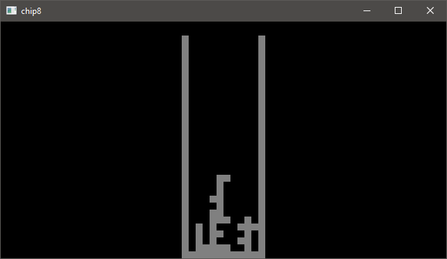

# chip8

This is my littly Chip-8 Emulator/Interpretor made purely in C without any libraries (rendering is achieved though a [library](https://github.com/Jaysmito101/cgl) though)

Here are some screenshots of this in action:

